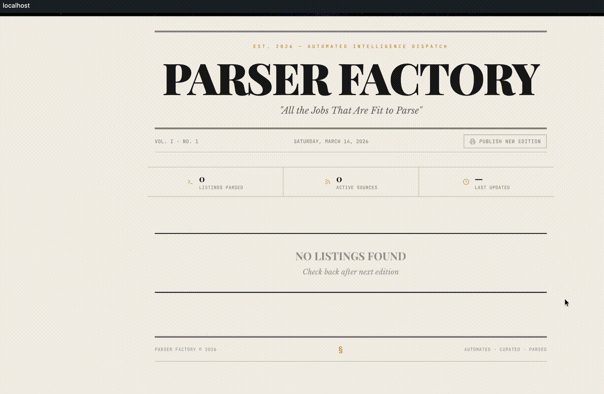

Rewrite README.md:

# parser-factory



Job listings parser with newspaper-style UI. Parses "Ask HN: Who is hiring?" threads from Hacker News.

## Stack

- **Backend:** PHP 8.3, custom framework, Factory/Strategy pattern
- **Frontend:** React 18, Vite, Tailwind CSS, Framer Motion
- **Database:** PostgreSQL 16
- **Proxy:** nginx

## Quick Start
```bash
make up
```

Open http://localhost

## Commands
```bash
make up       # start
make down     # stop
make build    # rebuild
make logs     # logs
make migrate  # run migrations
```
